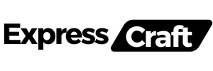

ExpressCraft is a command-line tool that allows you to quickly generate an Express application scaffold, getting you up and running with a basic Express server structure in no time.


## Installation

To use ExpressCraft, make sure you have Node.js and npm installed on your system. Then, you can install it globally using npm:

```bash
npm install -g expresscraft
```

## Usage

To generate a new Express application, simply run the following command:

```bash
npx expresscraft
```

This will prompt you to enter the name of your application, and then generate a new directory with the specified name containing the Express application scaffold.

## Getting Started

After Installing ExpressCraft, you can create a new Express application by running the following command:

```bash
npx expresscraft
```

This will prompt you to enter the name of your application, and then generate a new directory with the specified name containing the Express application scaffold.

Once the application has been generated, you can navigate to the new directory and start the server by running:

```bash

  _____                               ____            __ _   
 | ____|_  ___ __  _ __ ___  ___ ___ / ___|_ __ __ _ / _| |_ 
 |  _| \ \/ / '_ \| '__/ _ \/ __/ __| |   | '__/ _` | |_| __|
 | |___ >  <| |_) | | |  __/\__ \__ \ |___| | | (_| |  _| |_
 |_____/_/\_\ .__/|_|  \___||___/___/\____|_|  \__,_|_|  \__|
            |_|

✨ Welcome to Express Generator CLI tool.✨

🎯 Version: 1.4.0
🎗️  Author: @Ravikisha

This tool will help you to generate a new project with a template in Express js with all the necessary files, folders 📁 and dependencies 🗃️.

🕑 Let's get started by asking some questions to setup your project 🚀

? What is your project name? Ecommerce
? What is your project description?(optional) Ecommerce Application for NetFlix
? What is your project author?(optional) Ravi Kishan
? What is your project Package Manager? NPM
? What is your project language? TypeScript
? What is your project Version Control? Git
? What is your project template engine? EJS
? What is your project CSS Framework? Tailwind CSS
? What is your project database? PostgreSQL
? What is your project ORM? Prisma
? What is your project testing? Jest
? What is your project authentication? Passport.js
? What is your project linting? TSLint
? What is your project API Documentation? Swagger


✅ Generating Project....
✅ Folder created successfully.
✅ Project created successfully.
✅ Setup Details in Project.
✅ Git initialized successfully.
✅ EJS initialized successfully.
✅ Tailwind CSS initialized successfully.
🔔 Run the following command to generate the database schema:
---------------------------
npx prisma generate
---------------------------
✅ Database and ORM setup complete.

Jest configuration written to "C:\Users\ravi\Desktop\ExpressCraft\Ecommerce\jest.config.js".
✅ Jest installed successfully
npm WARN deprecated tslint@6.1.3: TSLint has been deprecated in favor of ESLint. Please see https://github.com/palantir/tslint/issues/4534 for more information.
✅ TSLint installed successfully
✅ Swagger installed successfully

💗 Thanks for using ExpressCraft .....

🚀 Your project is ready!

👉 Get started with the following commands:

👍 Run Your Project:

1️⃣  Open your terminal

2️⃣  Go to your project directory
-----------------------------------
cd Ecommerce
-----------------------------------

3️⃣  Run the following command

------------ 💻 Dev Mode --------------
npm run dev
------------ 📈 Production Mode --------------
npm start
-----------------------------------

😎 Happy Coding! 🎉

🌟 If you like ExpressCraft, give us a star on GitHub
```

This prompt will ask you a series of questions to set up your project. Once you have answered all the questions, the project will be generated with the specified configuration.

You can then navigate to the new directory and start the server by running:

```bash
cd Ecommerce
npm run dev
```

This will start the server in development mode, and you can access it by navigating to `http://localhost:3000` in your web browser.

## Changelog
Check out the [CHANGELOG](CHANGELOG.md) for the latest updates and changes to the project.

## Contributing

Contributions are welcome! If you find any issues or have suggestions for improvements, feel free to open an issue or submit a pull request on the [GitHub repository](https://github.com/ravikisha/expresscraft).

## License

This project is licensed under the MIT License - see the [LICENSE](LICENSE) file for details.